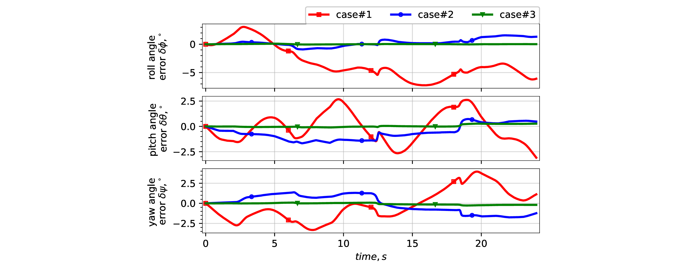
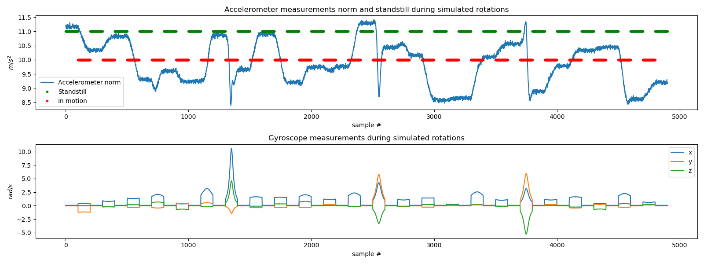
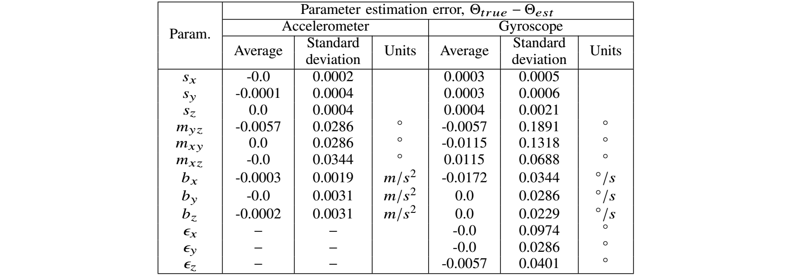

# IMU-calib

A novel calibration method for **gyroscopes** and accelerometers. Contrary to existing methods the
proposed one **does not require a rotating table or other special equipment**. To perform the calibration a user needs to make
a series of sequential rotations of inertial measurement unit
(IMU) separated by standstill periods.

This is the supplementary code and the implementation of the ideas, presented in [IEEE paper](#Citation).

## Overview
The proposed approach allows to perform full IMU calibration: scale factors, non-orthogonalities and biases of accelerometer and gyroscope triads and misalignment between them.

The proposed method is quite accurate: the differences between true and estimated sensor errors were less than 0.1% of their true value.

The importance of full gyroscope calibration can be shown through orientation difference between true and gyroscope-integrated orientations. The three cases are shown on the plot: 
1. No corrections of gyroscope raw data.
2. Only gyroscope bias was corrected.
3. Gyroscope scale, cross-coupling and bias were corrected.



After the calibration the orientation error is almost zero.


## Usage

### Simulation
To run the monte-carlo simulations please issue the following command:
```
python3 run_monte_carlo.py --plot=True
```
As the output, you will see the true and estimated sensor error parameters and uncalibrated/calibrated measurements for both sensors.


IMUs calibration results for five real sensors (MPU-9150) are shown here:


### Real IMU
For real IMU calibration we provide the datasets from five different InvenSense MPU-9150 IMUs. Please note, one important requirement: the sensor has to be kept static after each rotation. The standstill flags are generated automatically from the data using ```generate_standstill_flags``` function. To find the calibration parameters issue the following command:
```
python3 calibrate_real_imu.py --sampling_frequency=100 --file=data/imu0.log
```
and see the found parameters as the output.

### Jupyter
The jupyter notebook is [here](Example.ipynb).


## Results
The proposed method has been proven to be unbiased via numerical simulations.
The differences between true and estimated sensor error parameters for 200 Monte-Carlo simulations are shown in the following table:


IMUs calibration results for five real sensors (MPU-9150) are shown here:


## Paper
This is the accompanying code for "In-situ gyroscope calibration based on accelerometer data" paper that was presented on 27th Saint Petersburg International Conference on Integrated Navigation Systems (ICINS).

### Citation
If you use the code, the authors will be grateful for citing:
```
@inproceedings{mikov2020situ,
  title={In-situ Gyroscope Calibration Based on Accelerometer Data},
  author={Mikov, Aleksandr and Reginya, Sergey and Moschevikin, Alex},
  booktitle={2020 27th Saint Petersburg International Conference on Integrated Navigation Systems (ICINS)},
  pages={1--5},
  year={2020},
  organization={IEEE}
}
```
